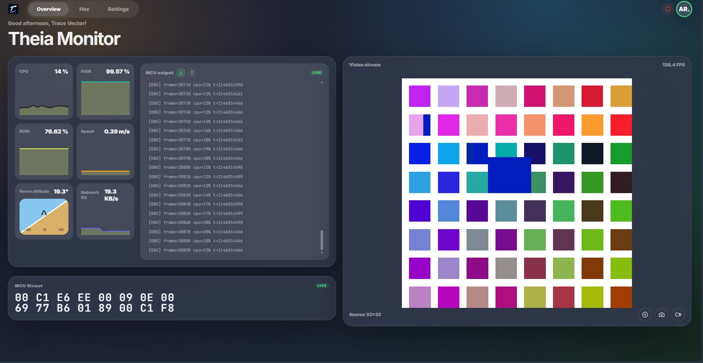

# Theia Monitor

原名 Trace-Vector-PChost 为[我队21届智能车竞赛所适配](https://github.com/META-Xiao/Trace-Vector)上位机，在开发的过程中对其进行大幅扩展，目前可以支持市面上常见的MCU

<!--  -->

<!--  -->

<!--  -->



## 功能特性

- **图传显示**： 实时显示 MCU 图像数据，支持 Binary1 / Gray8 / RGB565 / RGB888 / YUV422，编码 RAW / RLE / HeatShrink / Tile / Patch
- **日志输出**： MCU DEBUG 日志实时显示
- **资源监控**： 可扩展的资源数据输出，并在上位机可视化显示，默认支持CPU/RAM/ROM 占用率、速度等折线图
- **录制和回放**： bin 文件保存 MCU 原始输出数据，支持离线回放与 Hex 分析
- **命令发送**： 向 MCU 发送控制指令（CLI）

## 协议规范

三路混合协议在**单条 UART** 上传输（8N1）：

```
┌────────┬──────────┬─────────────────────┬──────┐
│ Sync   │ Length   │ Body                │ CS   │
│ 1B     │ 2B (BE)  │ N bytes             │ 1B   │
└────────┴──────────┴─────────────────────┴──────┘
CS = Σ(Sync + Length + Body) & 0xFF
```

| 帧类型 | Sync | Body 结构 | 典型频率 |
|--------|------|-----------|---------|
| 图传 | 0xCC | FrameID(2B) + W(1B) + H(1B) + Format(1B) + Payload | 硬件决定¹ |
| 日志 | 0xDD | UTF-8 文本 (≤ 256B) | ≤ 5 Hz |
| 资源 | 0xEE | CPU(1B) + RAM(2B) + ROM(2B) + Speed(2B) + Servo(2B) | ≤ 5 Hz |
| CLI | 0xFF | Flags(1B) + UTF-8 文本 (≤ 255B) | 按需 |

> ¹ **Host 不设帧率上限。** 实际 FPS = MCU 渲染 + 传输时间。USB-CDC 下小帧传输可忽略，瓶颈在渲染；物理 UART 下大帧带宽可能成为瓶颈。FreeRTOS 可做动态帧率——场景简单时自动快、复杂时自动慢，Host 零改动。

**Format 字节**：高 4 位 = PixelFormat，低 4 位 = Codec

| PixelFormat | 值 | 说明 | Codec | 值 | 说明 |
|-------------|------|------|-------|------|------|
| Binary1 | 0 | 1bpp 二值化 | RAW | 0 | 无压缩 |
| Gray8 | 1 | 8bpp 灰度 | RLE | 1 | 游程编码 |
| RGB565 | 2 | 16bpp 彩色 | HeatShrink | 2 | LZ 压缩 |
| RGB888 | 3 | 24bpp 真彩 | Tile | 3 | 分块变化检测 |
| YUV422 | 4 | 16bpp 色度抽样 | Patch | 4 | 矩形变化检测 |

详见 [telemetry_protocol.md](docs/telemetry_protocol.md)

## 项目结构

```
src/
├── serial/                   # 协议层（解析 / 编解码 / 录制回放）
│   ├── protocol.ts           #   帧类型、PixelFormat、Codec 定义
│   ├── parser.ts             #   帧解析状态机
│   ├── port.ts               #   WebSerial 封装
│   ├── manager.ts            #   事件总线
│   ├── image-processor.ts    #   图像解码器（RAW / RLE / HS / Tile / Patch）
│   ├── *-manager.ts          #   图像 / 日志 / 资源管理器
│   ├── record.ts             #   录制（→ .bin）
│   ├── replay.ts             #   回放（.bin →）
│   └── __tests__/            #   100+ 单元测试
├── composables/              # Vue 状态管理
│   └── useTelemetry.ts       #   串口 + 数据统一入口
├── stores/                   # 全局状态
├── views/
│   ├── Overview.vue          #   主仪表板
│   ├── HexView.vue           #   Hex 编辑器
│   └── SettingsView.vue      #   设置
└── components/               # UI 组件
    ├── VisionPane.vue        #   图传渲染
    ├── BinOutput.vue         #   二进制帧输出
    ├── LogCard.vue           #   日志面板
    └── SensorCard.vue        #   传感器卡片
```

## 快速开始

```bash
npm install
npm run dev        # 开发服务器
npm run test       # 运行测试
npm run build      # Web 构建
npm run tauri:dev  # Tauri 桌面开发
npm run tauri:build# 打包 EXE
npm run cap:sync   # 打包 APK
```

## 开发进度

- [x] 串口通信层（WebSerial、帧解析、校验和，100+ 测试）
- [x] 图传解析（灰度→RGBA、丢帧检测、FPS 统计）
- [x] 日志解析与显示
- [x] 资源帧解析（CPU/RAM/ROM/速度/舵机）
- [x] 主仪表板 UI（Overview / Vision / Settings，响应式）
- [x] 截图 / 录制功能
- [x] `useTelemetry` composable（串口+数据管理统一入口）
- [x] 图传 Canvas 直接渲染（当前为 mirror 模式）
- [x] CLI 命令发送面板
- [x] Settings 功能实际生效（Channels 开关、Display 设置）
- [x] 录制和回放功能（bin 文件直接读写）
- [x] WIFI 传输功能
- [ ] CLI 命令发送功能
- [ ] CLI 在MCU上接收指令并执行相应任务的方法文档

## TODO

- [x] **Hex 查看器**：这个页面将替代现有的vision界面（vision界面看起来多余了）
  - [x] 打开已有 .bin 文件进行离线查看
  - [x] Hex 查看器：类似 Hex Editor，按字节显示二进制数据
  - [x] 不同帧类型（0xCC/0xDD/0xEE）用不同颜色高亮
  - [x] 每帧内分块标注：Header（帧头+长度+帧号）、Data（图像/日志/资源数据）、Checksum
  - [x] 鼠标悬停显示字段名称和数值解析
  - [x] 悬浮帧时右侧显示图片预览 + Payload hex dump

- [ ] `serial` 实现 Pixel Format：JPEG(5)、PNG(6)、User(7)
- [ ] `serial` 实现 Codec：TileHS(5)、PatchHS(6) 

## 文档

- [资源帧 API](docs/RESOURCE_API.md)
- [图传 API](docs/IMAGE_API.md)
- [日志 API](docs/LOG_API.md)
